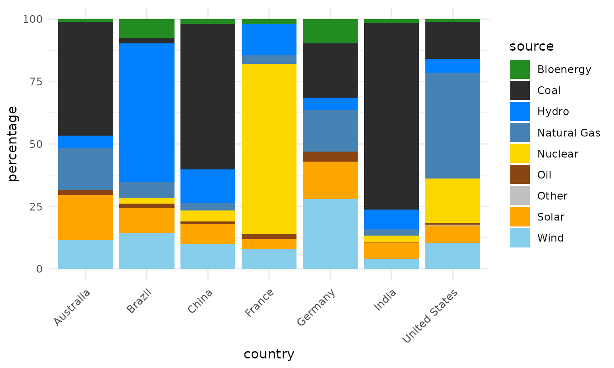
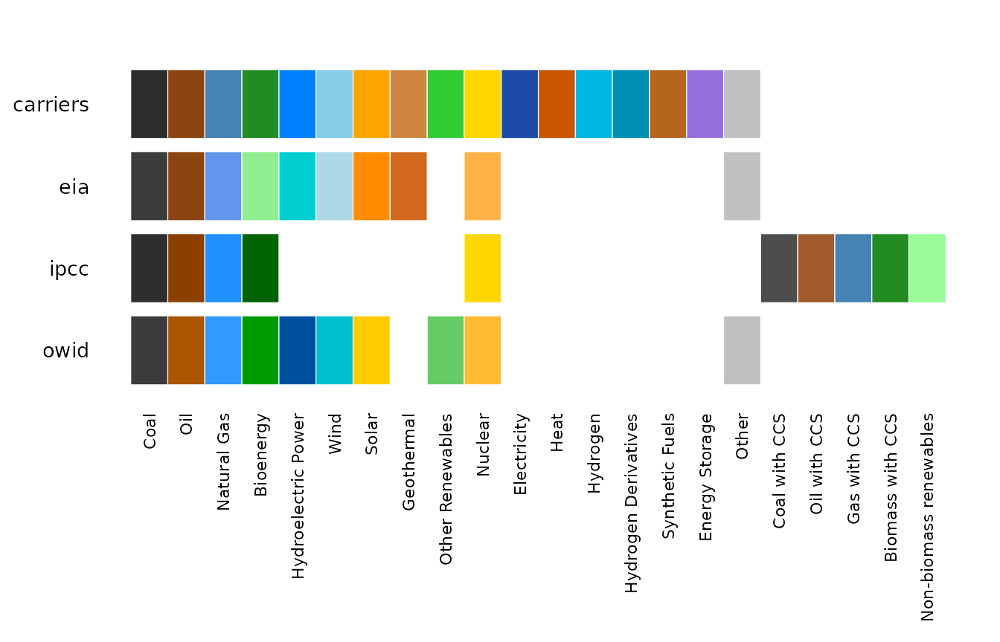
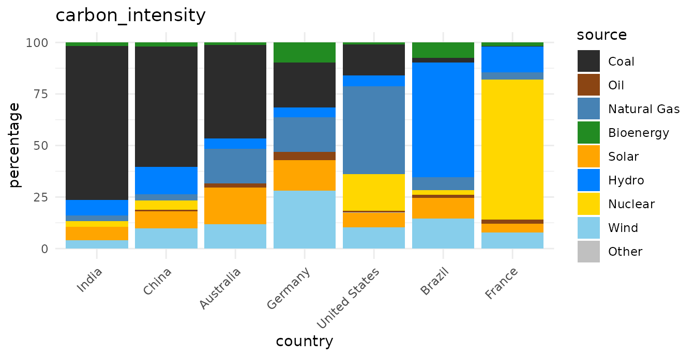
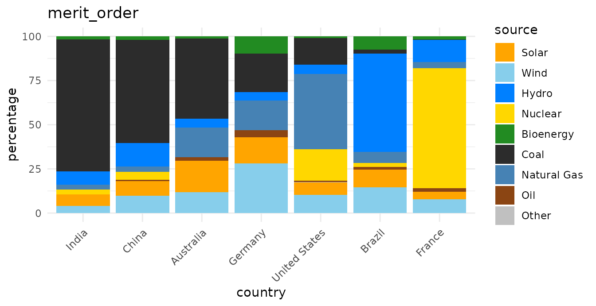
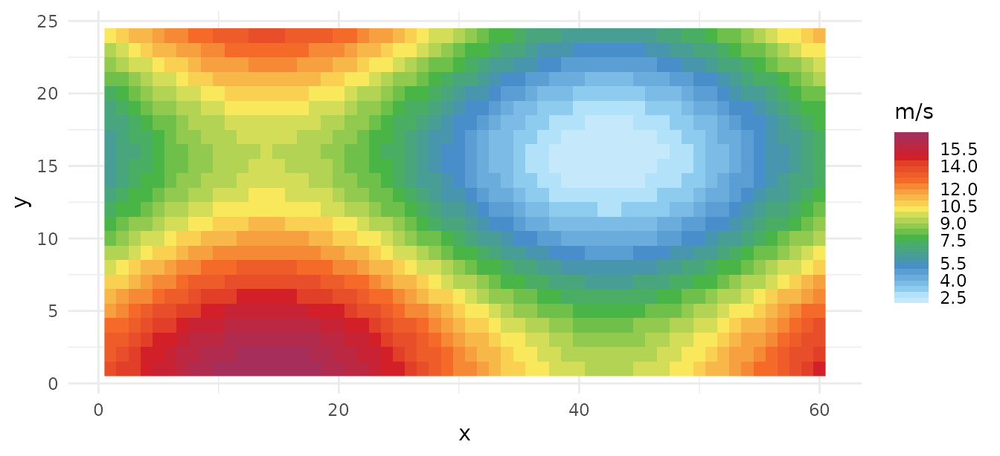
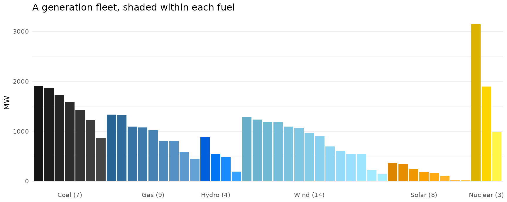

# Getting started with energypal

``` r

library(energypal)
library(ggplot2)
library(dplyr)
```

## The problem

Energy datasets do not agree on what to call things. One says
`Natural Gas`, another `nat gas`, a third `NG`; plant-level data says
`COAL1` and `COAL2`. Published figures then colour them inconsistently,
so two charts of the same system are hard to compare.

`energypal` keeps the colours in YAML files with their provenance, and
resolves whatever labels your data happens to use onto them.

``` r

d <- owid_energy_mix |> filter(year == max(year))
unique(d$source)
#> [1] "Bioenergy"   "Coal"        "Hydro"       "Natural Gas" "Nuclear"    
#> [6] "Oil"         "Solar"       "Wind"        "Other"

ggplot(d, aes(country, percentage, fill = source)) +
  geom_col() +
  scale_fill_energy() +
  theme_minimal() +
  theme(axis.text.x = element_text(angle = 45, hjust = 1))
```



No preprocessing, no manual colour vector, no renaming.

Seven mixes in arbitrary order are hard to compare, though. A palette
carries more than colour — `carriers` records a carbon intensity per
fuel — so the countries can be ordered by how carbon-intensive their mix
is:

``` r

carriers <- energypal_match(unique(d$source), warn = FALSE) |>
  select(source = original, carrier = matched)

# One row per carrier that has a figure. A name can appear twice in the table -
# Nuclear is both a group and the carrier inside it - and joining on it unfiltered
# fans the data out.
intensity <- energypal_table("carriers") |>
  filter(!is.na(carbon_intensity)) |>
  distinct(carrier = name, carbon_intensity)

rank <- d |>
  left_join(carriers, by = "source") |>
  left_join(intensity, by = "carrier") |>
  group_by(country) |>
  summarise(ci = weighted.mean(carbon_intensity, percentage, na.rm = TRUE)) |>
  arrange(desc(ci))

rank
#> # A tibble: 7 × 2
#>   country          ci
#>   <chr>         <dbl>
#> 1 India         640. 
#> 2 China         511. 
#> 3 Australia     482. 
#> 4 Germany       287. 
#> 5 United States 240. 
#> 6 Brazil         69.9
#> 7 France         34.9

d <- d |> mutate(country = factor(country, levels = rank$country))
```

> **That is an ordering, not an emissions estimate.** The intensities
> are indicative lifecycle medians for arranging charts; see the caveat
> below. Every figure from here on uses this ordered `d`.

## Getting a palette

[`energypal()`](https://optimal2050.github.io/energypal/reference/energypal.md)
returns a named colour vector. By default you get the main level — the
carriers themselves.

``` r

energypal()
#>          FossilCoal           FossilOil           FossilGas           Bioenergy 
#>           "#2C2C2C"           "#8B4513"           "#4682B4"           "#228B22" 
#>               Hydro                Wind               Solar          Geothermal 
#>           "#0080FF"           "#87CEEB"           "#FFA500"           "#CD853F" 
#>     OtherRenewables             Nuclear         Electricity                Heat 
#>           "#32CD32"           "#FFD700"           "#1F4BA8"           "#CC5500" 
#>            Hydrogen HydrogenDerivatives      SyntheticFuels             Storage 
#>           "#00B5E2"           "#008FB4"           "#B5651D"           "#9370DB" 
#>               Other 
#>           "#C0C0C0"
```

`n` takes the first few, as
[`RColorBrewer::brewer.pal()`](https://rdrr.io/pkg/RColorBrewer/man/ColorBrewer.html)
does:

``` r

energypal("eia", n = 5)
#> FossilCoal  FossilOil  FossilGas  Bioenergy      Hydro 
#>  "#3C3C3C"  "#8B4513"  "#6495ED"  "#90EE90"  "#00CED1"
```

The aggregate groups above the carriers, and the fuel subtypes below
them, are available but off by default — a plotting palette wants
distinct colours, and adjacent subtypes are deliberately near-identical.

``` r

length(energypal("carriers"))
#> [1] 17
length(energypal("carriers", include_groups = TRUE, include_subtypes = TRUE))
#> [1] 93
```

Names can be canonical identifiers or display labels:

``` r

energypal("carriers", n = 4, label_style = "long")
#>        Coal         Oil Natural Gas   Bioenergy 
#>   "#2C2C2C"   "#8B4513"   "#4682B4"   "#228B22"
```

## What is available

``` r

energypal_info() |> select(name, title, type, n)
#>               name                                             title       type
#> 1         carriers                                   Energy carriers   discrete
#> 2              eia         EIA Annual Energy Outlook (approximation)   discrete
#> 3              epa      EPA greenhouse gas inventory (approximation)   discrete
#> 4             ipcc      IPCC AR6 WGIII energy supply (approximation)   discrete
#> 5             owid      Our World in Data energy mix (approximation)   discrete
#> 6   solaratlas_ghi                            Global Solar Atlas GHI continuous
#> 7 solaratlas_pvout                      Global Solar Atlas PV output continuous
#> 8     technologies                   Energy technologies and sectors   discrete
#> 9  windatlas_speed Global Wind Atlas mean wind speed (approximation) continuous
#>    n
#> 1 93
#> 2 12
#> 3 12
#> 4 11
#> 5 12
#> 6 28
#> 7 24
#> 8 80
#> 9 31
```

[`energypal_show()`](https://optimal2050.github.io/energypal/reference/energypal_show.md)
draws them. Given several names it draws an aligned comparison instead,
which is the quickest way to see how published schemes differ.

``` r

energypal_show(c("carriers", "eia", "ipcc", "owid"))
```



## Matching messy labels

[`energypal_colors()`](https://optimal2050.github.io/energypal/reference/energypal_colors.md)
maps labels to colours.
[`energypal_match()`](https://optimal2050.github.io/energypal/reference/energypal_match.md)
shows its working, which is what you want when a label is not colouring
as expected.

``` r

energypal_match(c("Coal", "natural gas", "Solar PV", "COAL1", "Flux Capacitor"))
#>         original    matched   color    method candidates
#> 1           Coal FossilCoal #2C2C2C     alias       <NA>
#> 2    natural gas NaturalGas #4682B4 canonical       <NA>
#> 3       Solar PV    SolarPV #FFA500 canonical       <NA>
#> 4          COAL1 FossilCoal #2C2C2C     alias       <NA>
#> 5 Flux Capacitor       <NA>    <NA>      <NA>       <NA>
```

The `method` column names the stage that resolved each label: an exact
match, a canonicalised one (case, spacing and punctuation removed), a
declared alias, a fuzzy match, or containment. Anything unresolved comes
back grey rather than silently taking a neighbour’s colour.

Aliases live in the palette file, not in the package code, so your own
palette can teach the matcher your own vocabulary. More on that below.

## Ordering

Legend and stack order carry meaning in energy charts. Palettes declare
orderings by name:

``` r

energypal_orders("carriers") |> select(order, kind, n)
#>              order     kind  n
#> 1 carbon_intensity declared  9
#> 2  dispatchability declared 10
#> 3      merit_order declared  8
#> 4     renewability declared 10
#> 5             spec computed 93
#> 6            alpha computed 93
#> 7              hue computed 93
#> 8        lightness computed 93
#> 9           chroma computed 93
```

``` r

for (o in c("carbon_intensity", "merit_order")) {
  print(
    ggplot(d, aes(country, percentage, fill = source)) +
      geom_col() +
      scale_fill_energy(order = o) +
      labs(title = o) +
      theme_minimal() +
      theme(axis.text.x = element_text(angle = 45, hjust = 1))
  )
}
```



The sequence changes; the colour of each carrier does not.

> **Orderings are for presentation only.** They arrange legends and
> chart series. They are indicative, not validated figures, and must not
> be used in calculations. Every declared ordering carries a note saying
> so, and
> [`energypal_orders()`](https://optimal2050.github.io/energypal/reference/energypal_orders.md)
> prints it:

``` r

cat(energypal_orders("carriers")$note[1])
#> Presentation only. Orders chart series and legends; NOT a model input and not to be used in calculations. Lifecycle medians vary widely with fuel quality, plant vintage, capacity factor and system boundary.
```

If your fill column is already a factor, its level order is respected —
leave `order` alone and set the factor levels as you normally would.

## Continuous and binned scales

Resource maps need a ramp rather than a set of categories. Those
palettes are `type = "continuous"` and carry their own break points.

``` r

grid <- expand.grid(x = 1:60, y = 1:24)
grid$wind <- 2 + 15 * (sin(grid$x / 9) + cos(grid$y / 5) + 2) / 4

ggplot(grid, aes(x, y, fill = wind)) +
  geom_raster() +
  scale_fill_energy_b(palette = "windatlas") +
  labs(fill = "m/s") +
  theme_minimal()
```



[`scale_fill_energy_b()`](https://optimal2050.github.io/energypal/reference/scale_energy.md)
takes the bins from the palette;
[`scale_fill_energy_c()`](https://optimal2050.github.io/energypal/reference/scale_energy.md)
gives a smooth gradient instead. Passing a continuous palette to the
discrete scale, or the reverse, is an error rather than a silent
half-result.

## Several series, one carrier

Plant-level data is the common case: a fleet has three coal units, two
gas turbines and four wind farms, and colouring by carrier alone draws
them all identically. `gradient = TRUE` spreads each cluster into
distinct tones of its carrier, so the fuel is still readable at a glance
but the units are told apart.

``` r

energypal_colors(c("Coal_Ratcliffe", "Coal_Drax", "Coal_Cottam",
                   "CCGT_Pembroke", "CCGT_Staythorpe", "Wind_Whitelee"),
                 gradient = TRUE, warn = FALSE)
#>  Coal_Ratcliffe       Coal_Drax     Coal_Cottam   CCGT_Pembroke CCGT_Staythorpe 
#>       "#141414"       "#2C2C2C"       "#464646"       "#276494"       "#64A1D5" 
#>   Wind_Whitelee 
#>       "#87CEEB"
```

Each cluster is grouped by the *carrier it resolved to*, not by its
colour, so two carriers that happen to share a hex code still get their
own gradients. A carrier with a single unit keeps the plain palette
colour.

The same argument works on the scale, which is how you would normally
use it. Keeping each fuel’s units adjacent is what makes the clusters
legible, and
[`energypal_match()`](https://optimal2050.github.io/energypal/reference/energypal_match.md)
gives you the carrier to sort on. Here is a whole fleet — forty-five
units across six fuels:

``` r

set.seed(42)
unit_group <- function(prefix, k, lo, hi) {
  data.frame(unit = sprintf("%s_%02d", prefix, seq_len(k)),
             mw = round(runif(k, lo, hi)))
}

fleet <- bind_rows(
  unit_group("Coal", 7, 400, 2000), unit_group("CCGT", 9, 300, 1400),
  unit_group("Hydro", 4, 100, 900), unit_group("Wind", 14, 50, 1300),
  unit_group("Solar", 8, 20, 400), unit_group("Nuclear", 3, 900, 3200)
)

fleet <- fleet |>
  left_join(energypal_match(fleet$unit, warn = FALSE) |>
              select(unit = original, carrier = matched),
            by = "unit") |>
  mutate(carrier = factor(carrier, levels = names(energypal()))) |>
  arrange(carrier, desc(mw)) |>
  mutate(unit = factor(unit, levels = unit))

# forty-five unit names will not fit, so label each cluster once instead
clusters <- fleet |>
  group_by(carrier) |>
  summarise(at = unit[ceiling(n() / 2)], units = n(), .groups = "drop") |>
  left_join(energypal_table("carriers") |> distinct(carrier = name, label = label_short),
            by = "carrier")

ggplot(fleet, aes(unit, mw, fill = unit)) +
  geom_col() +
  scale_fill_energy(gradient = TRUE) +
  scale_x_discrete(breaks = clusters$at,
                   labels = sprintf("%s (%d)", clusters$label, clusters$units)) +
  labs(title = "A generation fleet, shaded within each fuel",
       x = NULL, y = "MW") +
  theme_minimal(base_size = 10) +
  theme(panel.grid.major.x = element_blank(), legend.position = "none")
```



Every unit gets its own colour, and the fuel is still readable across
the whole chart:

``` r

fleet |>
  mutate(color = energypal_colors(as.character(unit), gradient = TRUE, warn = FALSE)) |>
  group_by(carrier) |>
  summarise(units = n(), colours = n_distinct(color))
#> # A tibble: 6 × 3
#>   carrier    units colours
#>   <fct>      <int>   <int>
#> 1 FossilCoal     7       7
#> 2 FossilGas      9       9
#> 3 Hydro          4       4
#> 4 Wind          14      14
#> 5 Solar          8       8
#> 6 Nuclear        3       3
```

The shades are computed in OKLAB, a perceptually uniform space, so the
step looks the same whether the carrier is near-black coal or bright
yellow nuclear — the previous HSV implementation collapsed bright
colours to a single tone.
[`energypal_gradient()`](https://optimal2050.github.io/energypal/reference/energypal_gradient.md)
does this for one colour on its own:

``` r

energypal_gradient("#FFA500", n = 5)     # Solar
#> [1] "#DD8500" "#EE9500" "#FFA500" "#FFB52C" "#FFC644"
energypal_gradient("#2C2C2C", n = 5)     # Coal
#> [1] "#141414" "#202020" "#2C2C2C" "#393939" "#464646"
```

## Your own palette

A named vector is a palette. Save it, edit it, load it back.

``` r

p <- energypal_create(c(Coal = "#4E4E4E", Gas = "#2E86AB", Solar = "#F6AE2D"),
                      name = "myproject")
f <- tempfile(fileext = ".yml")
energypal_write(p, f)
cat(readLines(f), sep = "\n")
#> # energypal palette
#> #
#> # Each entry may be a bare colour, or a map with _color, _short, _long and
#> # _aliases. Add detail to individual entries as needed; the rest can stay simple.
#> 
#> meta:
#>   name: myproject
#>   title: myproject
#>   version: 0.1.0
#> 
#> colors:
#>   Coal: "#4E4E4E"
#>   Gas: "#2E86AB"
#>   Solar: "#F6AE2D"
```

Entries start as bare colours and can be expanded in place with labels
and aliases, without restructuring the file:

``` r

writeLines(c(
  "meta:",
  "  name: myproject",
  "colors:",
  '  Coal: "#4E4E4E"',
  "  Gas:",
  '    _color: "#2E86AB"',
  "    _long: Natural Gas",
  "    _aliases: [nat gas, NG, methane]"
), f)

energypal_colors(c("Coal", "nat gas", "METHANE"), file = f)
#>      Coal   nat gas   METHANE 
#> "#4E4E4E" "#2E86AB" "#2E86AB"
```

[`energypal_register()`](https://optimal2050.github.io/energypal/reference/energypal_register.md)
makes a file available by name for the rest of the session, so it can be
used anywhere a built-in name works:

``` r

energypal_register("myproject", f)
energypal("myproject")
#>      Coal       Gas 
#> "#4E4E4E" "#2E86AB"
```

## Where next

- [`vignette("palettes", package = "energypal")`](https://optimal2050.github.io/energypal/articles/palettes.md)
  previews every palette with its sources.
- [`energypal_info()`](https://optimal2050.github.io/energypal/reference/energypal_info.md)
  lists what is installed, including palettes you register.
- Adding a palette is one YAML file and no code.
