# The palettes

``` r

library(energypal)
library(ggplot2)
library(dplyr)
```

Every palette is a YAML file under `inst/extdata/palettes/`, carrying
its own colours, labels, aliases and provenance. This article previews
all of them.

Nothing here is hard-coded: the sections below are generated from
[`energypal_info()`](https://optimal2050.github.io/energypal/reference/energypal_info.md),
so a palette added to the store appears without this file being edited.

## What is installed

``` r

info <- energypal_info()

info |>
  select(name, title, type, n, unit) |>
  knitr::kable()
```

| name | title | type | n | unit |
|:---|:---|:---|---:|:---|
| carriers | Energy carriers | discrete | 93 | NA |
| eia | EIA Annual Energy Outlook (approximation) | discrete | 12 | NA |
| epa | EPA greenhouse gas inventory (approximation) | discrete | 12 | NA |
| ipcc | IPCC AR6 WGIII energy supply (approximation) | discrete | 11 | NA |
| owid | Our World in Data energy mix (approximation) | discrete | 12 | NA |
| solaratlas_ghi | Global Solar Atlas GHI | continuous | 28 | kWh/m2/yr |
| solaratlas_pvout | Global Solar Atlas PV output | continuous | 24 | kWh/kWp |
| technologies | Energy technologies and sectors | discrete | 80 | NA |
| windatlas_speed | Global Wind Atlas mean wind speed (approximation) | continuous | 31 | m/s |

The two kinds are handled differently throughout, so it is worth naming
them once:

``` r

discrete <- info |> filter(type == "discrete") |> pull(name)
continuous <- info |> filter(type == "continuous") |> pull(name)

discrete
#> [1] "carriers"     "eia"          "epa"          "ipcc"         "owid"        
#> [6] "technologies"
continuous
#> [1] "solaratlas_ghi"   "solaratlas_pvout" "windatlas_speed"
```

## All at a glance

Given several names,
[`energypal_show()`](https://optimal2050.github.io/energypal/reference/energypal_show.md)
draws them as aligned rows — one per palette, one column per entry.
Differences between published schemes are easier to see this way than in
any table.

``` r

energypal_show(discrete)
```

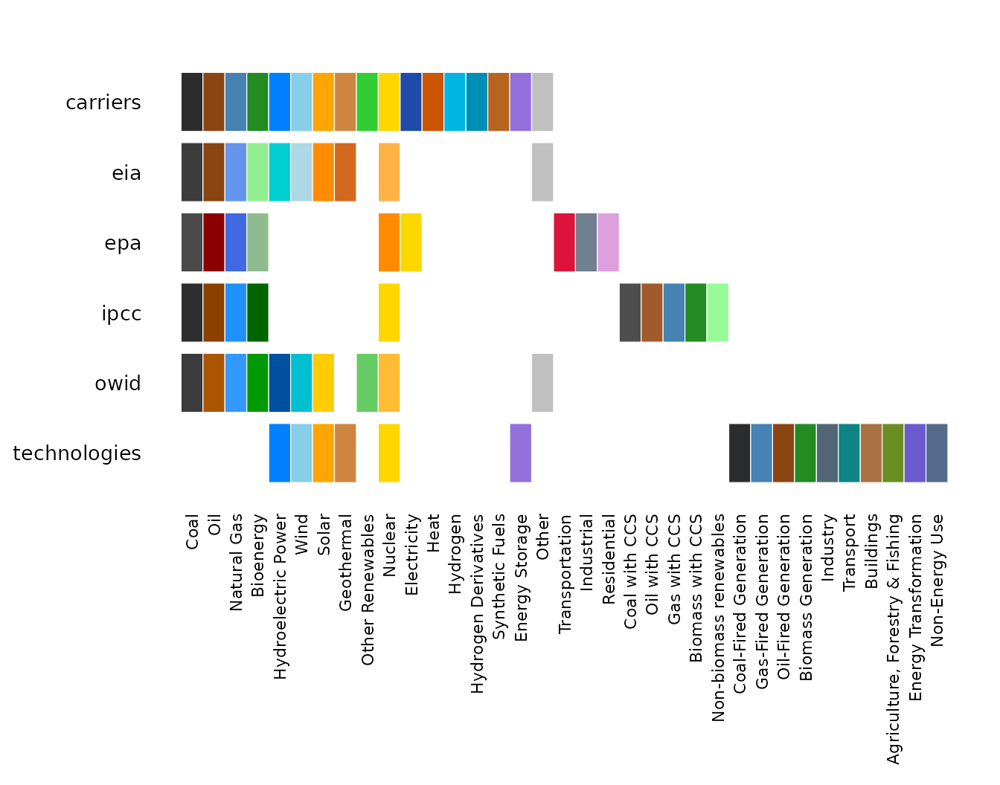

Entries that only some palettes define trail off to the right: IPCC’s
CCS variants, EPA’s sector categories, the technologies taxonomy.

Continuous palettes have no entries to align on, so several of them are
drawn stacked instead, each with its own range and unit:

``` r

energypal_show(continuous)
```

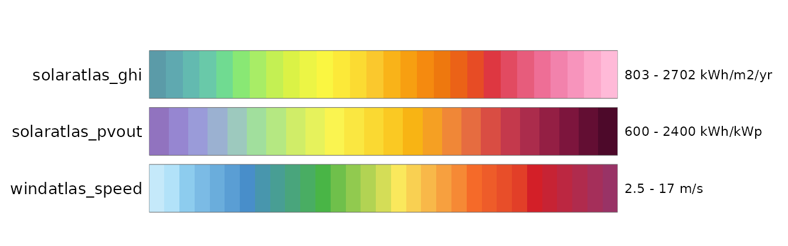

## Discrete palettes

A palette shows only the colours its own source publishes. Report
palettes `extends: carriers`, which gives them the taxonomy — names,
labels, aliases, hierarchy, orderings — but **not** its colours. So a
carrier a source is silent about comes back unmapped rather than quietly
borrowing the default:

``` r

setdiff(names(energypal("carriers")), names(energypal("owid")))
#> [1] "Geothermal"          "Electricity"         "Heat"               
#> [4] "Hydrogen"            "HydrogenDerivatives" "SyntheticFuels"     
#> [7] "Storage"

# OWID publishes no geothermal series, and says so
energypal_match("Geothermal", palette = "owid", warn = FALSE)
#>     original    matched color      method candidates
#> 1 Geothermal Geothermal  <NA> unpublished       <NA>

# ...while the inherited alias vocabulary still resolves
energypal_colors("nat gas", palette = "owid", warn = FALSE)
#>   nat gas 
#> "#3399FF"
```

That is why these palettes are worth choosing between: each is its
source’s own set, not the default with a few edits. Three earlier
palettes (`iea`, `fossil`, `renewable`) were dropped for failing that
test — `iea` differed from `carriers` in zero carrier-level entries,
because `carriers` was seeded from it.

``` r

for (nm in discrete) {
  spec <- energypal_spec(nm)
  m <- spec$meta

  cat("\n### ", if (is.null(m$title)) nm else m$title, "  \n", sep = "")
  cat("`", nm, "`\n\n", sep = "")
  if (!is.null(m$source)) cat("**Source** ", m$source, "  \n", sep = "")
  if (!is.null(m$url))    cat("**URL** <", m$url, ">  \n", sep = "")
  if (!is.null(m$extends)) cat("**Extends** `", m$extends, "`  \n", sep = "")
  if (!is.null(m$license)) cat("\n> **Licence** ", m$license, "\n", sep = "")
  if (!is.null(m$attribution)) {
    cat("\n> **Attribution** ", m$attribution, "\n", sep = "")
  }
  cat("\n")

  energypal_show(nm, label_style = "default")
  cat("\n\n")
}
```

### Energy carriers

`carriers`

**Source** IPCC 2006 Guidelines, IEA World Energy Balances, EIA fuel
categories  
**URL** <https://www.ipcc-nggip.iges.or.jp/public/2006gl/>

> **Licence** Colours are energypal’s own, following IEA World Energy
> Outlook conventions (dark grey coal, blue gas, orange solar, pale blue
> wind). They are not reproduced from any single published figure. The
> taxonomy follows the classifications cited per branch as
> `_taxonomy_source`.

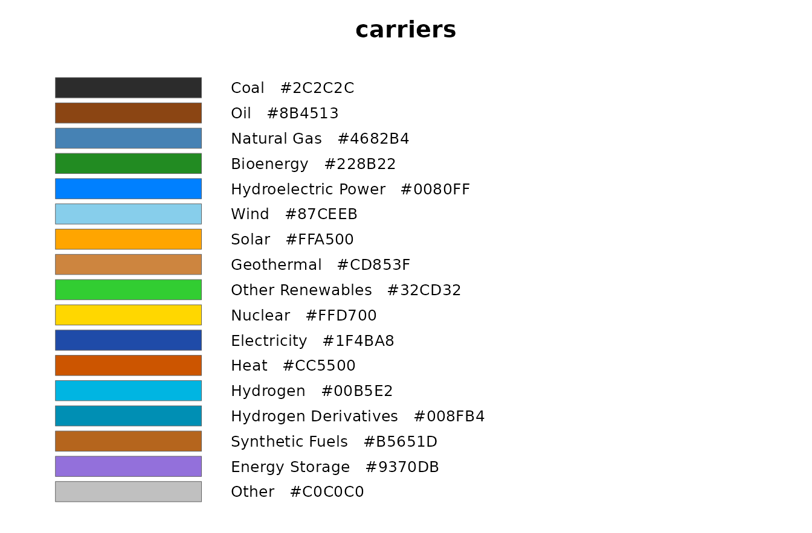

### EIA Annual Energy Outlook (approximation)

`eia`

**Source** EIA Annual Energy Outlook 2023, Fig. ES-1 “Energy consumption
by source”  
**URL** <https://www.eia.gov/outlooks/aeo/>  
**Extends** `carriers`

> **Licence** Public domain. A work of the U.S. federal government, not
> subject to copyright protection in the United States (17 U.S.C. 105).
> Colours approximated by eye from published figures; the EIA and EPA
> publish no colour specification.

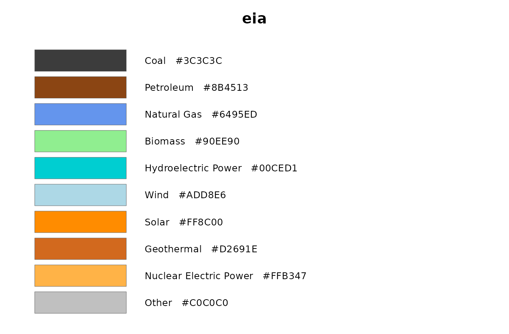

### EPA greenhouse gas inventory (approximation)

`epa`

**Source** EPA Inventory of U.S. Greenhouse Gas Emissions and Sinks, Ch.
2 “Trends in Greenhouse Gas Emissions”  
**URL**
<https://www.epa.gov/ghgemissions/inventory-us-greenhouse-gas-emissions-and-sinks-1990-2021>  
**Extends** `carriers`

> **Licence** Public domain. A work of the U.S. federal government, not
> subject to copyright protection in the United States (17 U.S.C. 105).
> Colours approximated by eye from published figures; the EPA publishes
> no colour specification.

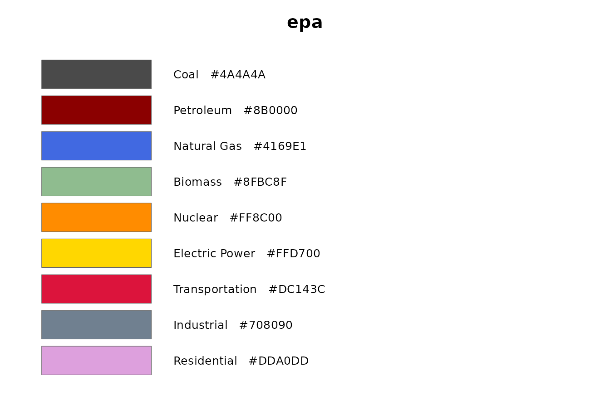

### IPCC AR6 WGIII energy supply (approximation)

`ipcc`

**Source** IPCC AR6 WGIII, Chapter 3, Fig. 3.8 “Energy Supply in
Illustrative Pathways”  
**URL**
<https://www.ipcc.ch/report/ar6/wg3/downloads/report/IPCC_AR6_WGIII_Chapter03.pdf>  
**Extends** `carriers`

> **Licence** IPCC material may be reproduced with acknowledgement of
> the source. Colours approximated by eye from a published figure; the
> IPCC publishes no colour specification for energy carriers.

> **Attribution** Colours after IPCC, 2022: Climate Change 2022 -
> Mitigation of Climate Change. Contribution of Working Group III to the
> Sixth Assessment Report of the Intergovernmental Panel on Climate
> Change, Chapter 3, Figure 3.8. Approximated from the published figure;
> not an IPCC colour specification.

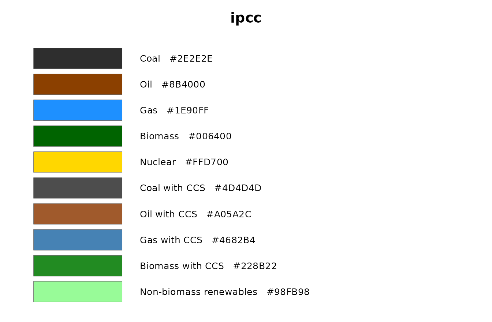

### Our World in Data energy mix (approximation)

`owid`

**Source** Our World in Data, “Energy Mix” interactive charts  
**URL** <https://ourworldindata.org/energy-mix>  
**Extends** `carriers`

> **Licence** CC BY 4.0
> (<https://creativecommons.org/licenses/by/4.0/>). Colours approximated
> by eye from published charts; OWID publishes no colour specification.

> **Attribution** Colours after Our World in Data, “Energy Mix”
> (<https://ourworldindata.org/energy-mix>), licensed CC BY 4.0.
> Approximated from published charts; not an official OWID
> specification.

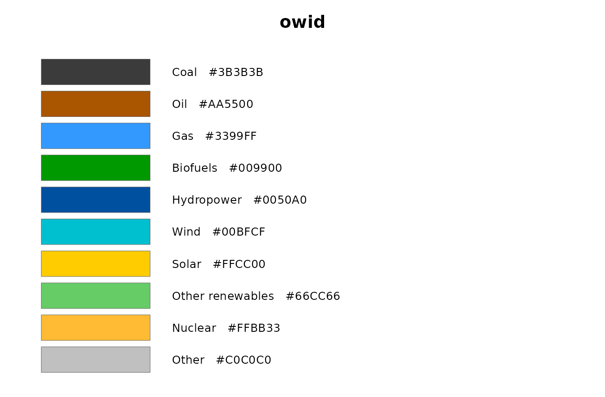

### Energy technologies and sectors

`technologies`

**Source** IEA Energy Technology Perspectives, IPCC 2006 Guidelines
(Vol.2 Energy)  
**URL** <https://www.ipcc-nggip.iges.or.jp/public/2006gl/>

> **Licence** Colours are energypal’s own, derived from the `carriers`
> palette so that a technology and the carrier it consumes read as the
> same family. They are not reproduced from any published figure. The
> sectoral groupings follow IEA and IPCC conventions.

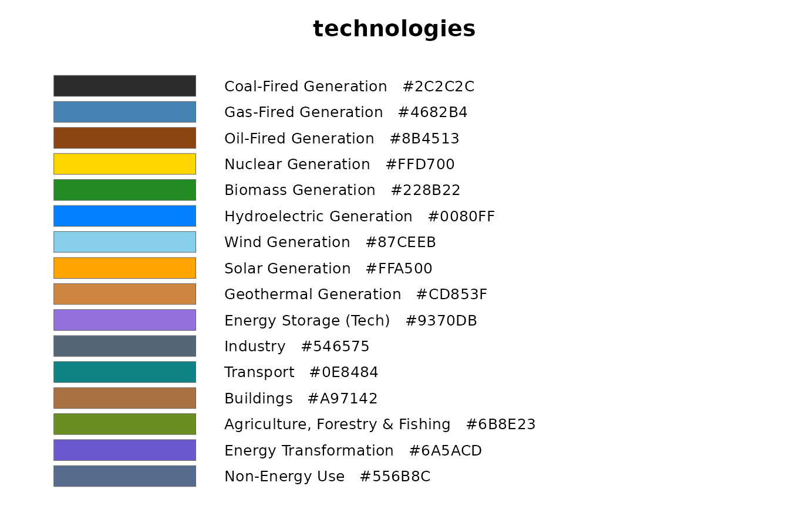

## Continuous palettes

Resource maps need a ramp rather than a set of categories. These
palettes are an ordered list of stops and declare their own break points
and unit, so a binned scale needs no configuration.

``` r

for (nm in continuous) {
  spec <- energypal_spec(nm)
  m <- spec$meta
  brk <- as.numeric(unlist(spec$breaks))

  cat("\n### ", if (is.null(m$title)) nm else m$title, "  \n", sep = "")
  cat("`", nm, "` — family `", m$family, "`, measure `", m$measure,
      "`, unit `", m$unit, "`  \n", sep = "")
  cat(length(energypal(nm)), " stops, ", length(brk), " breaks from ",
      min(brk), " to ", max(brk), "  \n", sep = "")
  if (!is.null(m$source)) cat("**Source** ", m$source, "  \n", sep = "")
  if (!is.null(m$license)) cat("\n> **Licence** ", m$license, "\n", sep = "")
  if (!is.null(m$attribution)) {
    cat("\n> **Attribution** ", m$attribution, "\n", sep = "")
  }
  cat("\n")

  energypal_show(nm)
  cat("\n\n")
}
```

### Global Solar Atlas GHI

`solaratlas_ghi` — family `solaratlas`, measure `ghi`, unit
`kWh/m2/yr`  
28 stops, 27 breaks from 803 to 2702  
**Source** Global Solar Atlas 2.0 world GHI poster map
(World_GHI_poster-map_1500x800mm-300dpi)

> **Licence** CC BY 4.0
> (<https://creativecommons.org/licenses/by/4.0/>), with the mandatory
> WIPO/UNCITRAL dispute-resolution addition in the GSA terms of use

> **Attribution** \[Data/information/map\] obtained from the Global
> Solar Atlas 2.0, a free, web-based application developed and operated
> by the company Solargis s.r.o. on behalf of the World Bank Group,
> utilizing Solargis data, with funding provided by the Energy Sector
> Management Assistance Program (ESMAP). For additional information:
> <https://globalsolaratlas.info>

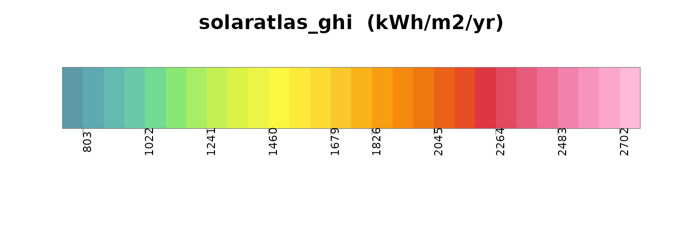

### Global Solar Atlas PV output

`solaratlas_pvout` — family `solaratlas`, measure `pvout`, unit
`kWh/kWp`  
24 stops, 23 breaks from 600 to 2400  
**Source** Global Solar Atlas 2.0 world PVOUT poster map
(World_PVOUT_poster-map_1500x800mm-300dpi)

> **Licence** CC BY 4.0
> (<https://creativecommons.org/licenses/by/4.0/>), with the mandatory
> WIPO/UNCITRAL dispute-resolution addition in the GSA terms of use

> **Attribution** \[Data/information/map\] obtained from the Global
> Solar Atlas 2.0, a free, web-based application developed and operated
> by the company Solargis s.r.o. on behalf of the World Bank Group,
> utilizing Solargis data, with funding provided by the Energy Sector
> Management Assistance Program (ESMAP). For additional information:
> <https://globalsolaratlas.info>

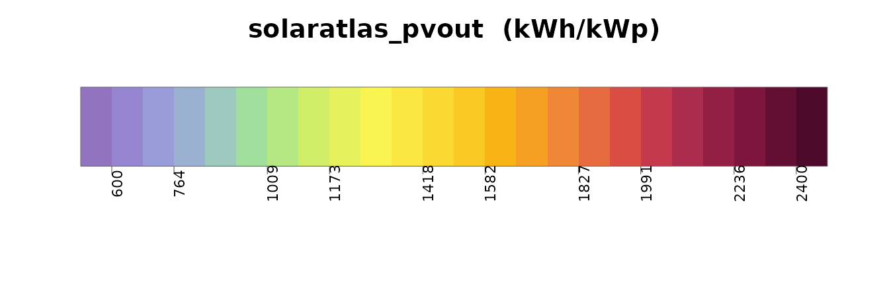

### Global Wind Atlas mean wind speed (approximation)

`windatlas_speed` — family `windatlas`, measure `speed`, unit `m/s`  
31 stops, 30 breaks from 2.5 to 17  
**Source** Approximation. Derived from an earlier version of the Global
Wind Atlas for the merra2ools package (c. 2020); values recovered by
sampling that package’s figure legend, the defining object
(palette.windatlas) having been lost. Atlas version unconfirmed and not
verified against GWA 3 or 4.

> **Licence** CC BY 4.0 IGO. Creative Commons ported the IGO variant at
> 3.0 only, so the operative deed text is CC BY 4.0
> (<https://creativecommons.org/licenses/by/4.0/>); the IGO qualifier
> and the mandatory, binding attribution addition are in the GWA terms
> of use at the url above

> **Attribution** \[Data/information/map\] obtained from the Global Wind
> Atlas, a free, web-based application developed, owned and operated by
> the Technical University of Denmark (DTU). The Global Wind Atlas
> versions 3 and 4 are released in partnership with the World Bank
> Group, utilizing data provided by Vortex, using funding provided by
> the Energy Sector Management Assistance Program (ESMAP). Cite The
> World Bank as the data provider and reference ESMAP as the source of
> funding.

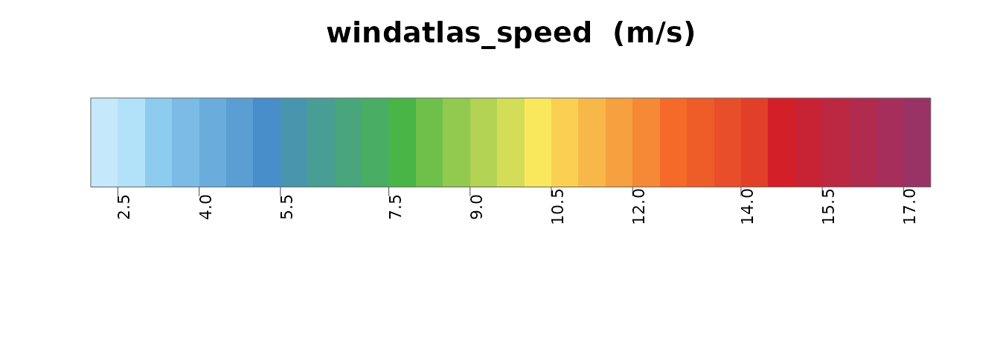

An atlas publishes several quantities and styles each differently, so
each is a separate palette named `family_measure`. They are not
interchangeable. One member of each family is its default, so the bare
family name resolves to it:

``` r

identical(energypal("windatlas"), energypal("windatlas_speed"))
#> [1] TRUE
energypal_info(family = "windatlas") |> select(name, measure, default, unit)
#>              name measure default unit
#> 1 windatlas_speed   speed    TRUE  m/s
```

Several measures published by the atlases are **not** included — wind
power density and IEC capacity-factor classes, solar DNI, DIF and GTI —
because no verified colour source for them was available, and guessing
would defeat the purpose of a store whose value is its provenance. They
are better added as one reviewable file each than approximated in bulk.

## Orderings

Order carries meaning in energy charts, so palettes declare it rather
than leaving it to whatever sequence the file happens to use.

``` r

energypal_orders("carriers") |>
  select(order, kind, n, source) |>
  knitr::kable()
```

| order | kind | n | source |
|:---|:---|---:|:---|
| carbon_intensity | declared | 9 | IPCC AR5 WGIII, Annex III, Table A.III.2 (lifecycle medians) |
| dispatchability | declared | 10 | IEA World Energy Outlook generation-stack conventions |
| merit_order | declared | 8 | Conventional dispatch-stack ordering; indicative only |
| renewability | declared | 10 | IEA / IRENA energy-mix chart conventions |
| spec | computed | 93 | NA |
| alpha | computed | 93 | NA |
| hue | computed | 93 | NA |
| lightness | computed | 93 | NA |
| chroma | computed | 93 | NA |

The same data under three of them. The sequence changes; the colour of
each carrier does not.

``` r

# countries ordered most carbon-intensive first, using the palette's own
# carbon-intensity property - a presentation ordering, not an emissions estimate
latest <- owid_energy_mix |> filter(year == max(year))

# one row per carrier that has a figure: a name can appear twice in the table
# (Nuclear is both a group and the carrier inside it), which would fan the join out
intensity <- energypal_table("carriers") |>
  filter(!is.na(carbon_intensity)) |>
  distinct(carrier = name, carbon_intensity)

rank <- latest |>
  left_join(energypal_match(unique(latest$source), warn = FALSE) |>
              select(source = original, carrier = matched), by = "source") |>
  left_join(intensity, by = "carrier") |>
  group_by(country) |>
  summarise(ci = weighted.mean(carbon_intensity, percentage, na.rm = TRUE)) |>
  arrange(desc(ci))

d <- latest |> mutate(country = factor(country, levels = rank$country))
for (o in c("carbon_intensity", "merit_order", "renewability")) {
  print(
    ggplot(d, aes(country, percentage, fill = source)) +
      geom_col() +
      scale_fill_energy(order = o) +
      labs(title = o, x = NULL, y = "%") +
      theme_minimal() +
      theme(axis.text.x = element_text(angle = 45, hjust = 1))
  )
}
```

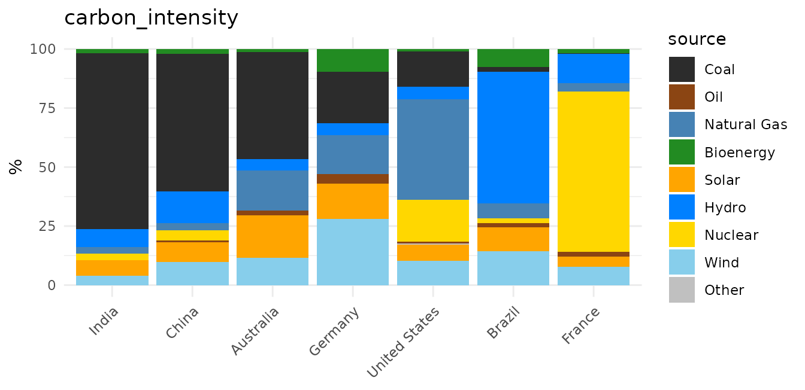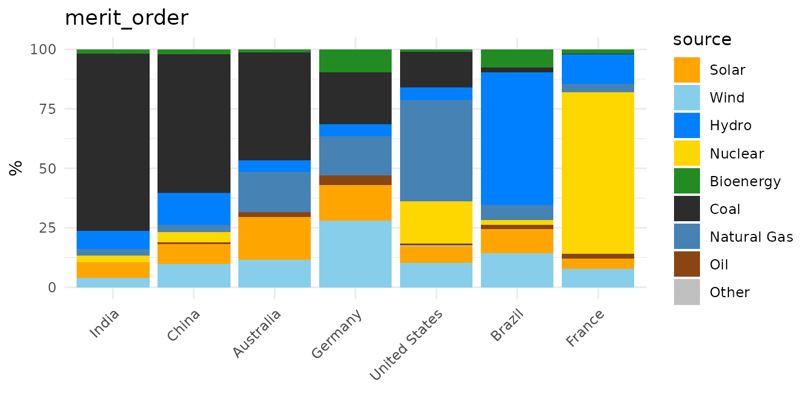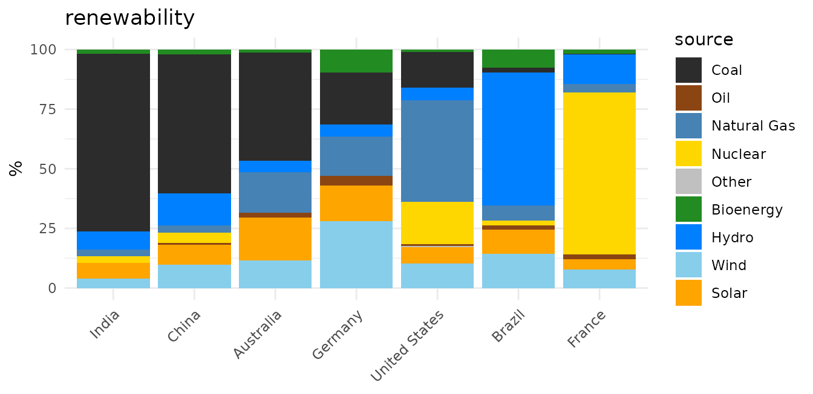

An ordering declared at carrier level covers the subtypes beneath it: an
entry the sequence does not name sorts with its nearest named ancestor,
so each fuel’s family stays together.

``` r

energypal_table("carriers", order = "carbon_intensity") |>
  select(name, type) |>
  head(10)
#>               name    type
#> 1       FossilCoal carrier
#> 2       Anthracite subtype
#> 3       Bituminous subtype
#> 4    SubBituminous subtype
#> 5          Lignite subtype
#> 6             Coke subtype
#> 7  OtherFossilCoal subtype
#> 8        FossilOil carrier
#> 9            Crude subtype
#> 10 ResidualFuelOil subtype
```

> **Orderings, and the figures behind them, are for presentation only.**
> They arrange legends and chart series. They are indicative values, not
> validated figures, and must not be used in calculations. Every
> declared ordering and numeric property carries a note saying so, which
> travels with the data:

``` r

tab <- energypal_table("carriers")
attr(tab$carbon_intensity, "note")
#> [1] "Presentation only - for ordering and shading. NOT a model input. These are indicative lifecycle medians across a wide reported range; use figures from your own scenario or inventory for any calculation.\n"
attr(tab$carbon_intensity, "source")
#> [1] "IPCC AR5 WGIII, Annex III, Table A.III.2 (lifecycle medians)"
```

## Shades within a carrier

Plant-level data repeats a carrier many times over — a fleet has several
coal units and a dozen wind farms.
[`energypal_gradient()`](https://optimal2050.github.io/energypal/reference/energypal_gradient.md)
spreads one palette colour into distinct tones so those clusters stay
apart without losing the fuel.

``` r

base <- energypal("carriers", n = 10)
n_sh <- 5

op <- par(mai = c(0.2, 1.15, 0.4, 0.2))
plot.new()
plot.window(xlim = c(0.5, n_sh + 0.5), ylim = c(length(base) + 0.5, 0.5))
for (i in seq_along(base)) {
  sh <- energypal_gradient(base[[i]], n = n_sh)
  for (j in seq_len(n_sh)) {
    rect(j - 0.5, i - 0.42, j + 0.5, i + 0.42, col = sh[j], border = "white", lwd = 0.6)
  }
  mtext(names(base)[i], side = 2, at = i, las = 1, line = 0.3, cex = 0.75)
}
title(main = sprintf("%d shades of each carrier", n_sh), cex.main = 0.95)
```

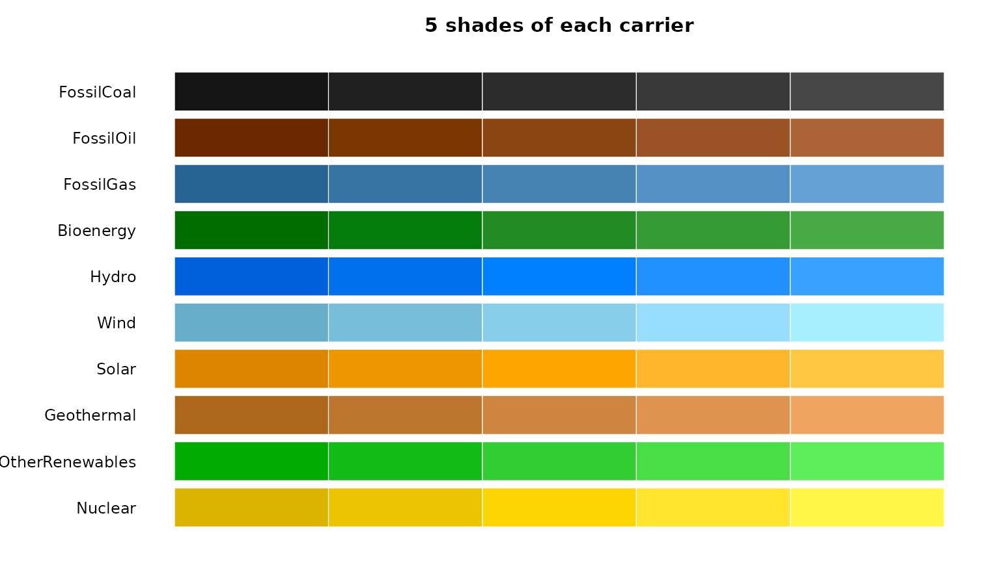

``` r

par(op)
```

The middle column is the palette colour; the gradient spreads
symmetrically around it in OKLAB rather than only lightening, which is
what keeps a bright carrier like Solar from collapsing to one tone.

`energypal_colors(gradient = TRUE)` applies this to data, grouping by
the carrier each label *resolved to*:

``` r

energypal_colors(c("Coal_1", "Coal_2", "Coal_3", "Wind_N", "Wind_S", "Solar_1"),
                 gradient = TRUE, warn = FALSE)
#>    Coal_1    Coal_2    Coal_3    Wind_N    Wind_S   Solar_1 
#> "#141414" "#2C2C2C" "#464646" "#67AECA" "#A7EFFF" "#FFA500"
```

Grouping by resolved carrier rather than by colour matters where two
entries share a hex code — `FossilCoal` and `OtherFossilCoal` are both
`#2C2C2C`, and grouping on the colour would merge them into one
gradient.

## The same chart, four ways

``` r

for (p in c("carriers", "eia", "ipcc", "owid")) {
  print(
    ggplot(d, aes(country, percentage, fill = source)) +
      geom_col() +
      scale_fill_energy(palette = p) +
      labs(title = p, x = NULL, y = "%") +
      theme_minimal() +
      theme(axis.text.x = element_text(angle = 45, hjust = 1))
  )
}
```

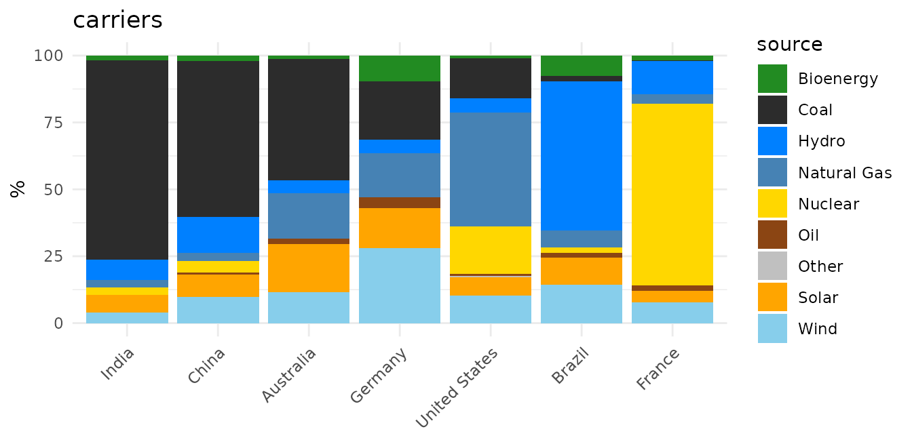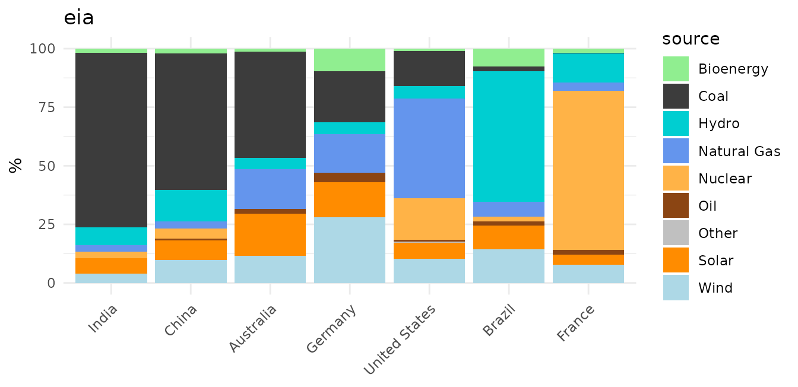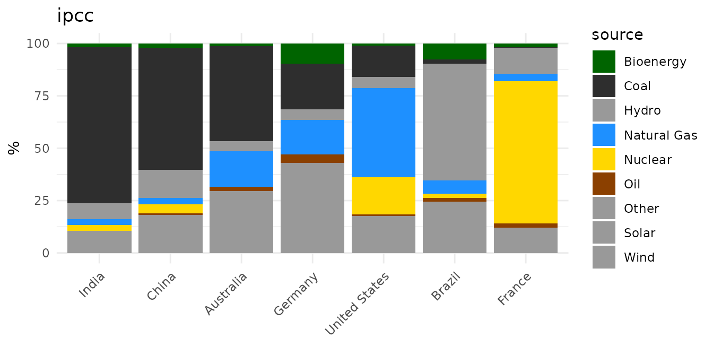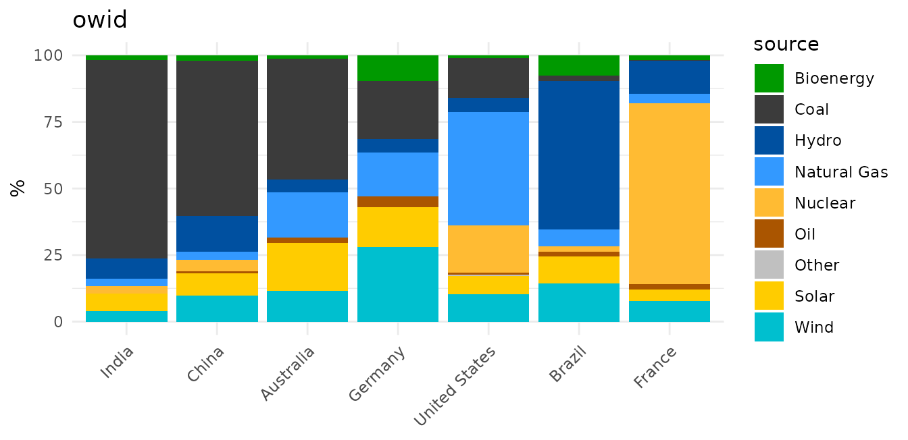

## Adding a palette

One YAML file in `inst/extdata/palettes/`, or anywhere on disk if you
pass `file =`. No code changes, no registration in a list, no test edits
— the validator tests iterate over the directory, so a new file is
picked up and checked automatically.

``` yaml
meta:
  name: myreport
  title: "Colours for the 2026 report"
  source: "Figure 4.2"
  license: "Our own colours"   # required: how they were obtained
  extends: carriers            # optional: inherit labels and aliases
colors:
  FossilCoal: "#3A3A3A"        # state only what this palette publishes
  FossilGas: "#5599CC"
```

`extends` applies each entry wherever that name occurs in the parent, at
any depth, keeping the labels and aliases it already had — and *only*
those two entries get a colour. A palette that wants to be standalone
simply omits it.

``` r

f <- tempfile(fileext = ".yml")
writeLines(c("meta:", "  name: myreport", "  license: Our own colours",
             "  extends: carriers",
             "colors:", '  FossilCoal: "#3A3A3A"'), f)

energypal_validate(energypal_spec(file = f))
energypal_colors(c("Coal", "coal power"), file = f)   # aliases inherited
#>       Coal coal power 
#>  "#3A3A3A"  "#3A3A3A"
energypal_colors("Solar", file = f, warn = FALSE)     # not declared here
#>     Solar 
#> "#999999"
```

### Provenance is required

[`energypal_validate()`](https://optimal2050.github.io/energypal/reference/energypal_validate.md)
refuses a palette that does not say where its colours came from, and one
declaring a CC BY licence without the citation that licence requires.
That rule exists because the store is only worth having if every entry
can be traced.

Colours reach a palette one of two ways, and `meta.license` always says
which: reproduced from a downloadable Work published under a licence
that permits it — the atlas poster maps — or approximated by eye from a
published figure, where the source publishes no colour specification at
all. The second is the common case, which is why those palettes are
titled *(approximation)*.

Your own palettes are exempt.
[`energypal_register()`](https://optimal2050.github.io/energypal/reference/energypal_register.md)
validates leniently, and `energypal_validate(..., strict = FALSE)`
checks structure alone:

``` r

mine <- energypal_create(c(Coal = "#FF0000", Solar = "#00FF00"), name = "mine")
energypal_validate(mine, strict = FALSE)
```
